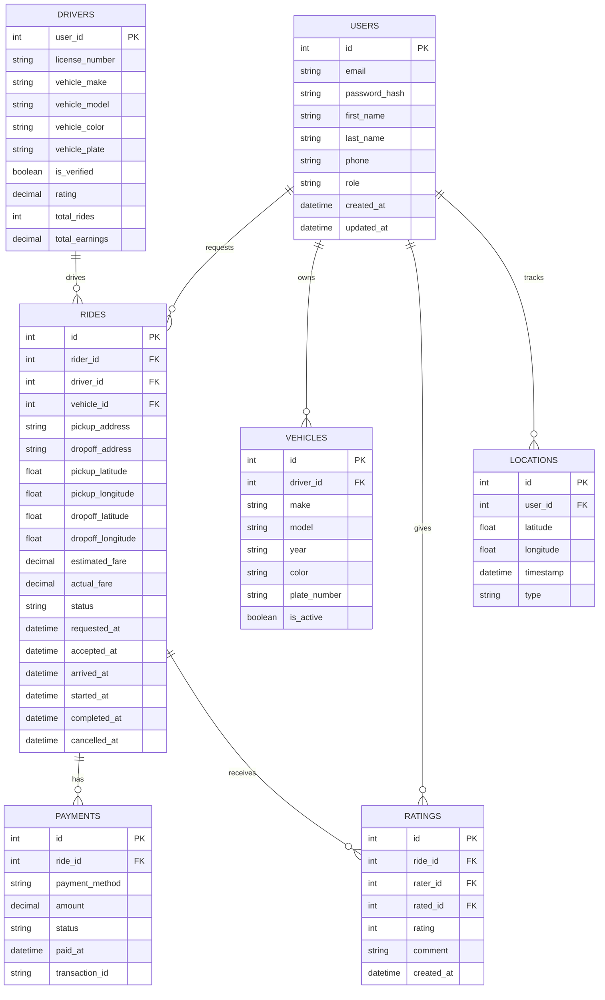

# System Architecture - Uber Clone Project

This document describes the complete system architecture for the Uber Clone project, detailing the structure, components, and interactions between different parts of the system.

## 1. High-Level Architecture

The Uber Clone system follows a microservices architecture pattern with three distinct frontend applications and three corresponding backend services:

```
┌─────────────────┐    ┌─────────────────┐    ┌─────────────────┐
│   Rider App     │    │  Driver App     │    │   Admin App     │
│  (Flutter)      │    │  (Flutter)      │    │  (Flutter)      │
└─────────┬───────┘    └────────┬────────┘    └────────┬────────┘
          │                     │                      │
          ▼                     ▼                      ▼
┌─────────────────┐    ┌─────────────────┐    ┌─────────────────┐
│ Rider Service   │    │ Driver Service  │    │ Admin Service   │
│ (Node.js)       │    │ (Node.js)       │    │ (Node.js)       │
└─────────┬───────┘    └────────┬────────┘    └────────┬────────┘
          │                     │                      │
          └─────────────────────┼──────────────────────┘
                                ▼
                      ┌─────────────────┐
                      │  PostgreSQL     │
                      │   Database      │
                      └─────────────────┘
```

## 2. Frontend Architecture

### 2.1 Flutter Applications

Each frontend application follows a similar structure but serves different roles:

#### Common Structure
```
lib/
├── config/                 # Environment configuration
├── models/                 # Data models
├── screens/                # UI screens
├── services/               # API services
├── theme/                  # UI theme and styling
├── widgets/                # Custom UI components
└── main.dart              # Application entry point
```

#### State Management
- **Provider Package**: Used for state management across all applications
- **Scoped Models**: For specific feature-level state management
- **Inherited Widgets**: For theme and configuration propagation

#### Navigation
- **Named Routes**: For consistent navigation between screens
- **Route Guards**: For authentication-based access control
- **Deep Linking**: For external URL handling

### 2.2 Shared Components

The `uber_shared` package contains reusable components:

```
lib/
├── models/                 # Shared data models
├── widgets/                # Shared UI components
│   ├── neomorphic/        # Neomorphic UI components
│   ├── map/               # Map components
│   └── common/            # Common widgets
├── utils/                  # Shared utility functions
└── theme/                  # Shared theme definitions
```

## 3. Backend Architecture

### 3.1 Microservices Structure

Each backend service follows a consistent structure:

```
src/
├── controllers/            # Request handlers
├── middleware/             # Authentication/validation
├── models/                 # Database models
├── routes/                 # API endpoints
├── services/              # Business logic
├── utils/                  # Utilities
└── config/                # Configuration files
```

### 3.2 Rider Service

**Responsibilities:**
- Rider authentication and profile management
- Ride request creation and management
- Fare estimation
- Payment processing
- Rating and feedback collection

**Key APIs:**
- `POST /api/auth/register` - Register new rider
- `POST /api/auth/login` - Rider login
- `GET /api/profile` - Get rider profile
- `PUT /api/profile` - Update rider profile
- `POST /api/rides` - Create new ride request
- `GET /api/rides/:id` - Get ride details
- `GET /api/rides` - Get ride history
- `POST /api/rides/:id/cancel` - Cancel ride
- `POST /api/rides/:id/rate` - Rate completed ride

### 3.3 Driver Service

**Responsibilities:**
- Driver authentication and profile management
- Driver availability status management
- Ride request notifications
- Ride acceptance/decline
- Location tracking
- Earnings management

**Key APIs:**
- `POST /api/auth/register` - Register new driver
- `POST /api/auth/login` - Driver login
- `GET /api/profile` - Get driver profile
- `PUT /api/profile` - Update driver profile
- `PUT /api/status` - Update driver availability
- `GET /api/rides/nearby` - Get nearby ride requests
- `POST /api/rides/:id/accept` - Accept ride request
- `POST /api/rides/:id/start` - Start ride
- `POST /api/rides/:id/complete` - Complete ride
- `GET /api/earnings` - Get earnings summary

### 3.4 Admin Service

**Responsibilities:**
- System monitoring and analytics
- User management (riders and drivers)
- Ride oversight
- Dispute resolution
- Configuration management

**Key APIs:**
- `POST /api/auth/login` - Admin login
- `GET /api/dashboard/stats` - Get system statistics
- `GET /api/users` - Get user list
- `GET /api/users/:id` - Get user details
- `PUT /api/users/:id` - Update user
- `DELETE /api/users/:id` - Delete user
- `GET /api/rides` - Get ride list
- `GET /api/rides/:id` - Get ride details
- `PUT /api/rides/:id` - Update ride
- `GET /api/analytics` - Get analytics data

## 4. Database Design

### 4.1 Entity Relationship Diagram



### 4.2 Database Schema

#### Users Table
```sql
CREATE TABLE users (
    id SERIAL PRIMARY KEY,
    email VARCHAR(255) UNIQUE NOT NULL,
    password_hash VARCHAR(255) NOT NULL,
    first_name VARCHAR(100) NOT NULL,
    last_name VARCHAR(100) NOT NULL,
    phone VARCHAR(20),
    role VARCHAR(20) NOT NULL CHECK (role IN ('rider', 'driver', 'admin')),
    created_at TIMESTAMP DEFAULT CURRENT_TIMESTAMP,
    updated_at TIMESTAMP DEFAULT CURRENT_TIMESTAMP
);
```

#### Drivers Table
```sql
CREATE TABLE drivers (
    user_id INTEGER PRIMARY KEY REFERENCES users(id),
    license_number VARCHAR(50),
    vehicle_make VARCHAR(50),
    vehicle_model VARCHAR(50),
    vehicle_color VARCHAR(30),
    vehicle_plate VARCHAR(20),
    is_verified BOOLEAN DEFAULT FALSE,
    rating DECIMAL(3,2) DEFAULT 0.00,
    total_rides INTEGER DEFAULT 0,
    total_earnings DECIMAL(10,2) DEFAULT 0.00
);
```

#### Rides Table
```sql
CREATE TABLE rides (
    id SERIAL PRIMARY KEY,
    rider_id INTEGER NOT NULL REFERENCES users(id),
    driver_id INTEGER REFERENCES users(id),
    vehicle_id INTEGER,
    pickup_address TEXT NOT NULL,
    dropoff_address TEXT NOT NULL,
    pickup_latitude DECIMAL(10, 8) NOT NULL,
    pickup_longitude DECIMAL(11, 8) NOT NULL,
    dropoff_latitude DECIMAL(10, 8) NOT NULL,
    dropoff_longitude DECIMAL(11, 8) NOT NULL,
    estimated_fare DECIMAL(10, 2),
    actual_fare DECIMAL(10, 2),
    status VARCHAR(20) NOT NULL CHECK (status IN ('requested', 'accepted', 'arrived', 'in_progress', 'completed', 'cancelled')),
    requested_at TIMESTAMP DEFAULT CURRENT_TIMESTAMP,
    accepted_at TIMESTAMP,
    arrived_at TIMESTAMP,
    started_at TIMESTAMP,
    completed_at TIMESTAMP,
    cancelled_at TIMESTAMP
);
```

## 5. Real-Time Communication

### 5.1 Socket.IO Implementation

All applications use Socket.IO for real-time communication:

#### Events Emitted by Server
- `ride_requested`: New ride available for drivers
- `ride_accepted`: Driver accepted ride
- `ride_arrived`: Driver arrived at pickup
- `ride_started`: Ride in progress
- `ride_completed`: Ride completed
- `location_update`: Real-time location update
- `chat_message`: New chat message

#### Events Listened by Server
- `location_update`: Driver/rider location update
- `chat_message`: Send chat message
- `ride_status_change`: Update ride status

### 5.2 Event Flow Examples

#### Ride Request Flow
1. Rider creates ride request via REST API
2. Server saves ride to database
3. Server emits `ride_requested` to nearby drivers
4. Drivers receive notification in real-time
5. Driver accepts ride via REST API
6. Server updates ride status
7. Server emits `ride_accepted` to rider
8. Both parties receive real-time location updates

## 6. Security Architecture

### 6.1 Authentication
- **JWT Tokens**: Stateless authentication
- **Role-Based Access Control**: Different permissions for rider/driver/admin
- **Session Management**: Token refresh and expiration

### 6.2 Authorization
- **Middleware**: Route-level authorization checks
- **Scopes**: Fine-grained permission control
- **Audit Logs**: Track user actions

### 6.3 Data Protection
- **Encryption**: Password hashing with bcrypt
- **HTTPS**: All API communication encrypted
- **Input Validation**: Prevent SQL injection and XSS

## 7. Deployment Architecture

### 7.1 Development Environment
```
Developer Machine
├── Flutter Apps (Rider/Driver/Admin)
├── Backend Services (3x Node.js microservices)
└── PostgreSQL Database
```

### 7.2 Production Architecture (Planned)
```
Internet → Load Balancer → Reverse Proxy (Nginx) →
  ├── Rider Service (Node.js cluster)
  ├── Driver Service (Node.js cluster)
  ├── Admin Service (Node.js cluster)
  ├── Redis (Caching/Messaging)
  └── PostgreSQL Cluster (Primary/Replica)
```

## 8. Scalability Considerations

### 8.1 Horizontal Scaling
- **Microservices**: Independent scaling of each service
- **Load Balancing**: Distribute requests across instances
- **Database Sharding**: Partition data for performance

### 8.2 Caching Strategy
- **Redis**: Session storage and real-time messaging
- **CDN**: Static assets delivery
- **Database Caching**: Query result caching

### 8.3 Database Optimization
- **Indexing**: Optimize frequently queried columns
- **Connection Pooling**: Efficient database connections
- **Read Replicas**: Offload read queries

## 9. Monitoring and Observability

### 9.1 Logging
- **Structured Logging**: Consistent log format
- **Log Levels**: DEBUG, INFO, WARN, ERROR
- **Centralized Logging**: Aggregate logs from all services

### 9.2 Metrics
- **Application Metrics**: Response times, error rates
- **Business Metrics**: Rides completed, earnings
- **System Metrics**: CPU, memory, disk usage

### 9.3 Tracing
- **Request Tracing**: End-to-end request tracking
- **Performance Profiling**: Identify bottlenecks
- **Error Tracking**: Capture and analyze exceptions

This architecture provides a solid foundation for the Uber Clone project, ensuring scalability, maintainability, and performance while following modern best practices.